# 🛡️ Dual SIEM Detection Lab
### Microsoft Sentinel + Splunk Enterprise | Real Attack Detection on Azure Honeypot

<p align="center">
  
  
  
  
  
  
  
  
</p>

<p align="center">
  <b>A production-grade dual-SIEM detection lab built on Azure — ingesting real Windows Security Events from a live honeypot VM into both Microsoft Sentinel and Splunk Enterprise simultaneously, with 5 detection rules mapped to MITRE ATT&CK, automated incident alerting, and cross-platform query parity.</b>
</p>

<p align="center">
  
  
  
  
</p>

---

## 📋 Table of Contents

- [What This Project Does](#-what-this-project-does)
- [Prerequisites & Cost](#-prerequisites--cost)
- [Architecture](#-architecture)
- [Tech Stack](#-tech-stack)
- [Quick Start](#-quick-start)
- [Lab Infrastructure Setup](#-lab-infrastructure-setup)
- [Data Pipeline](#-data-pipeline)
- [Detection Rules](#-detection-rules)
  - [Detection 1 — Brute Force by Source IP](#detection-1--brute-force-by-source-ip--mitret1110001)
  - [Detection 2 — Account Lockout Correlation](#detection-2--account-lockout-correlation--mitret1110)
  - [Detection 3 — Geo-Anomaly Lockout](#detection-3--geo-anomaly-lockout--mitret1078)
  - [Detection 4 — Privilege Escalation Baseline](#detection-4--privilege-escalation-behavioral-baseline--mitret1078003)
  - [Detection 5 — New User Persistence](#detection-5--new-user-account--persistence--mitret1136001)
- [Automated Alerting in Sentinel](#-automated-alerting-in-sentinel)
- [Repository Structure](#-repository-structure)
- [Key Findings](#-key-findings)
- [Lessons Learned & Challenges](#-lessons-learned--challenges)
- [Skills Demonstrated](#-skills-demonstrated)
- [About the Author](#-about-the-author)

---

## 🎯 What This Project Does

This lab simulates a real-world SOC environment where a **Windows Server 2022 honeypot** is deliberately exposed to the internet on Azure, attracting real brute-force attackers. Security events are simultaneously forwarded to **two independent SIEM platforms** — Microsoft Sentinel (via AMA/DCR) and Splunk Enterprise (via Universal Forwarder) — where identical detection logic is implemented in both **KQL** and **SPL**.

**The result:** 5 production-ready detection rules, cross-platform query parity, automated incident generation, and real attacker IPs caught in the wild — all on live infrastructure.

---

## 💳 Prerequisites & Cost

> ⚠️ **Cost Warning:** Cloud resources incur charges while running. Tear down all resources after completing the lab to avoid unexpected billing.

| Requirement | Detail |
|-------------|--------|
| **Microsoft Azure Subscription** | Required — free trial or pay-as-you-go |
| **Compute (Honeypot VM)** | Standard D2als v6 — 2 vCPUs, 4 GiB RAM |
| **Compute (Splunk VM)** | Standard D2als v6 — 2 vCPUs, 4 GiB RAM |
| **Splunk Enterprise** | 60-day free trial installer (Linux .tgz) |
| **Splunk Universal Forwarder** | Free — Windows MSI installer |
| **Estimated Cost** | ~$5–10 AUD/day with both VMs running |

---

## 🏗️ Architecture

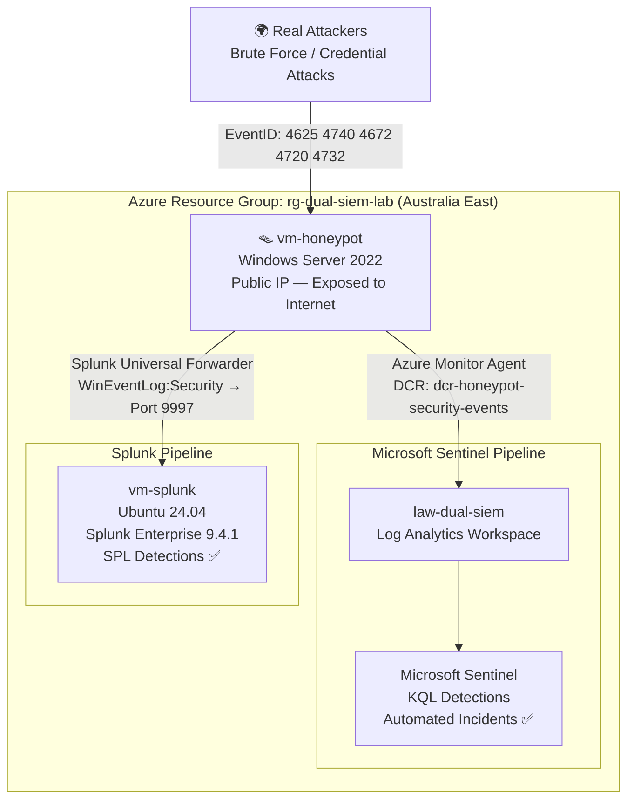
```mermaid
graph TD
    subgraph RG["Azure Resource Group: rg-dual-siem-lab (Australia East)"]
        A["🪤 vm-honeypot<br/>Windows Server 2022<br/>Public IP — Exposed to Internet"]

        subgraph SENTINEL["Microsoft Sentinel Pipeline"]
            B["law-dual-siem<br/>Log Analytics Workspace"]
            C["Microsoft Sentinel<br/>KQL Detections<br/>Automated Incidents ✅"]
            B --> C
        end

        subgraph SPLUNK["Splunk Pipeline"]
            D["vm-splunk<br/>Ubuntu 24.04<br/>Splunk Enterprise 9.4.1<br/>SPL Detections ✅"]
        end

        A -->|"Azure Monitor Agent<br/>DCR: dcr-honeypot-security-events"| B
        A -->|"Splunk Universal Forwarder<br/>WinEventLog:Security → Port 9997"| D
    end

    INTERNET["🌍 Real Attackers<br/>Brute Force / Credential Attacks"] -->|"EventID: 4625 4740 4672 4720 4732"| A
```

---

## 🛠️ Tech Stack

| Component | Technology | Details |
|-----------|-----------|---------|
| **Cloud** | Microsoft Azure | Australia East region |
| **Honeypot VM** | Windows Server 2022 Datacenter | Standard D2als v6 — 2 vCPUs, 4 GiB RAM |
| **SIEM 1** | Microsoft Sentinel | Workspace: `law-dual-siem` |
| **SIEM 2** | Splunk Enterprise 9.4.1 | Ubuntu 24.04, `vm-splunk` |
| **Log Forwarding → Sentinel** | Azure Monitor Agent + DCR | `dcr-honeypot-security-events` — AllEvents |
| **Log Forwarding → Splunk** | Splunk Universal Forwarder 10.4.0 | Index: `windows_honeypot` |
| **Query Language 1** | KQL (Kusto Query Language) | Sentinel detections |
| **Query Language 2** | SPL (Splunk Processing Language) | Splunk detections |
| **Detection Framework** | MITRE ATT&CK | T1110.001, T1110, T1078, T1078.003, T1136.001 |

---

## 🚀 Quick Start

> Summarised deployment path to replicate this lab from scratch.

**1. Provision Infrastructure**
- Create resource group `rg-dual-siem-lab` in Azure (Australia East)
- Deploy `vm-honeypot` — Windows Server 2022, Standard D2als v6, public IP enabled
- Deploy `vm-splunk` — Ubuntu 24.04, Standard D2als v6

**2. Configure Networking**
- On `vm-splunk-nsg`: open inbound ports 22 (SSH), 8000 (Splunk Web), 9997 (Forwarder)
- On `vm-honeypot-nsg`: leave RDP open for management (restrict by IP in production)

**3. Set Up Splunk**
- Install Splunk Enterprise 9.4.1 on `vm-splunk`
- Create index `windows_honeypot`
- Enable receiving on port 9997

**4. Set Up Splunk Universal Forwarder**
- Install Splunk UF 10.4.0 on `vm-honeypot`
- Configure `inputs.conf` — monitor `WinEventLog://Security`, index `windows_honeypot`
- Configure `outputs.conf` — forward to `vm-splunk:9997`
- Restart forwarder and verify events flow

**5. Set Up Microsoft Sentinel**
- Create Log Analytics Workspace `law-dual-siem`
- Deploy Microsoft Sentinel on the workspace
- Install **Windows Security Events** from Content Hub
- Create DCR `dcr-honeypot-security-events` via AMA connector — filter AllEvents, target `vm-honeypot`
- Verify with `SecurityEvent | take 10`

**6. Deploy Detections**
- Load `.kql` files from `queries/kql/` into Sentinel Analytics
- Load `.spl` files from `queries/spl/` into Splunk Search & Reporting
- Configure Sentinel analytic rule for Detection 1 — runs every 5 minutes

---

## 🔧 Lab Infrastructure Setup

### Step 1 — Azure Resource Group

All resources deployed under `rg-dual-siem-lab` in **Australia East** — 15 resources total including both VMs, networking components, Log Analytics Workspace, and Sentinel.

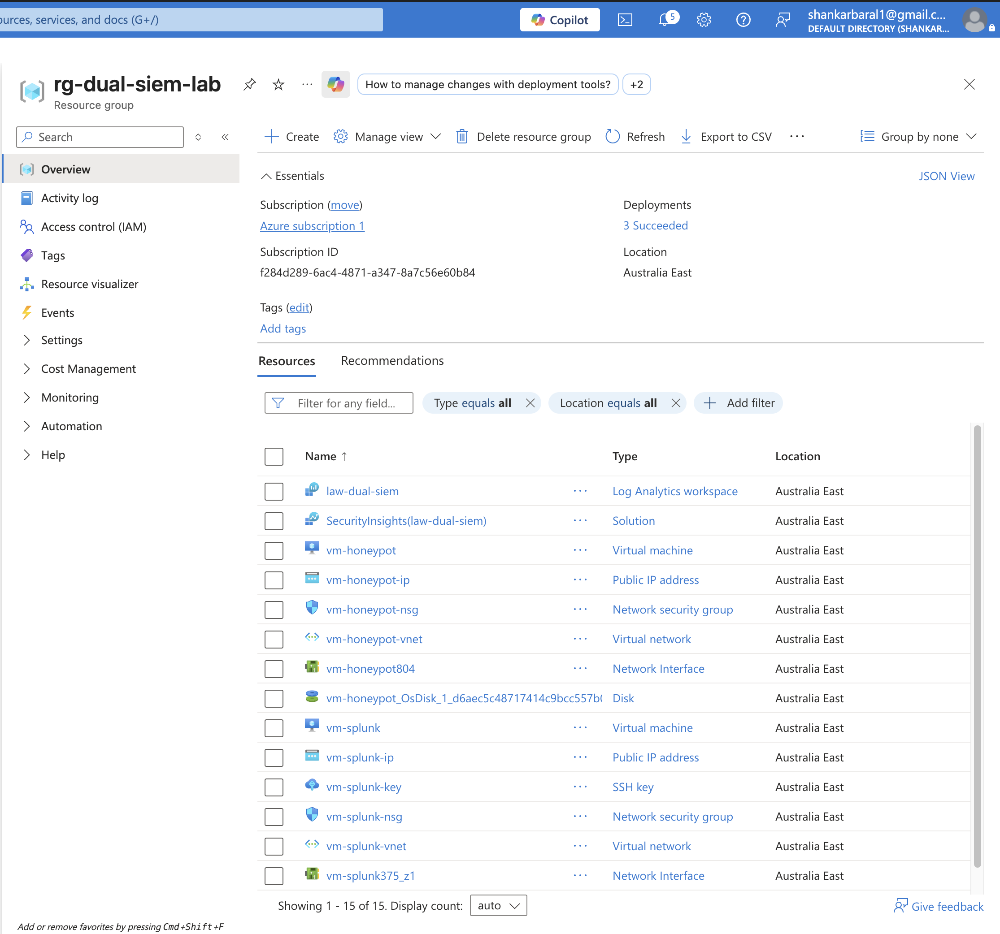

---

### Step 2 — Honeypot VM (Windows Server 2022)

`vm-honeypot` deployed as a Windows Server 2022 Datacenter VM (Standard D2als v6, 2 vCPUs, 4 GiB RAM) with a public IP — intentionally configured as an attack target open to the internet.

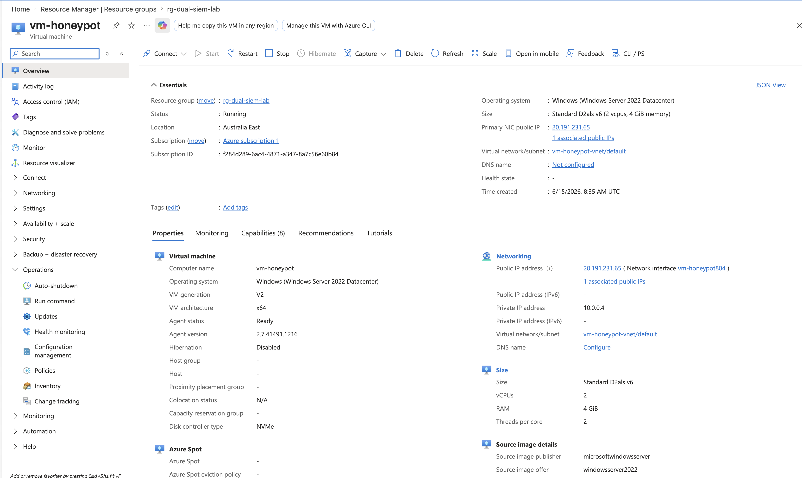

---

### Step 3 — Log Analytics Workspace

`law-dual-siem` workspace (Pay-as-you-go) created as the central data store for Microsoft Sentinel, receiving all Windows Security Events via Azure Monitor Agent.

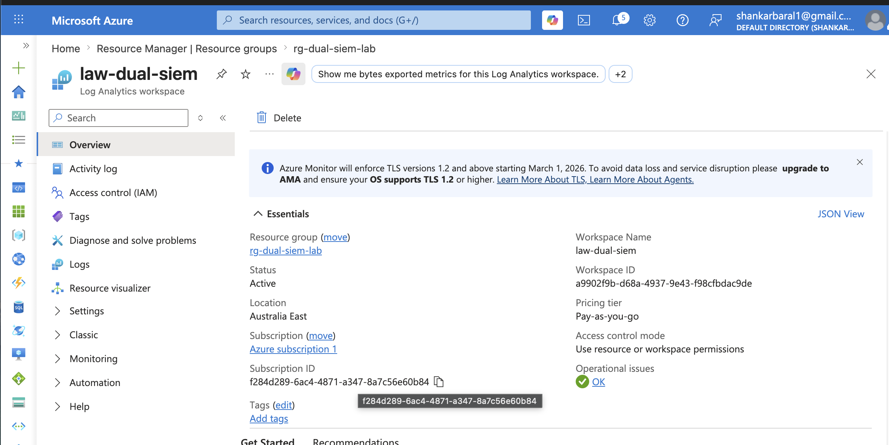

---

### Step 4 — Microsoft Sentinel Deployed

Microsoft Sentinel deployed and attached to the `law-dual-siem` workspace, ready to ingest events and fire automated analytics rules.

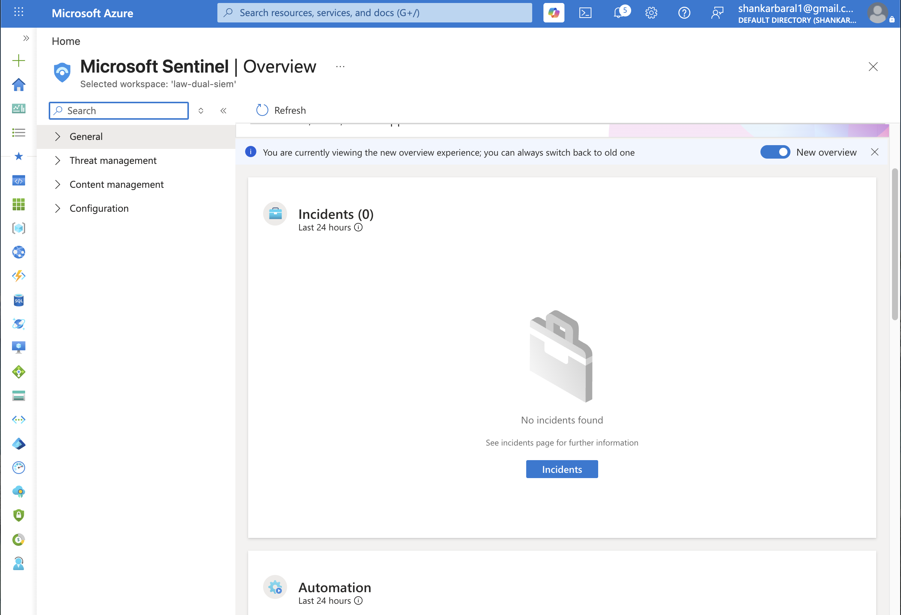

---

### Step 5 — Splunk VM (Ubuntu 24.04)

`vm-splunk` deployed — Ubuntu 24.04 VM (Standard D2als v6) running Splunk Enterprise 9.4.1, with Azure NSG rules opening ports **8000** (web UI) and **9997** (forwarder receiver).

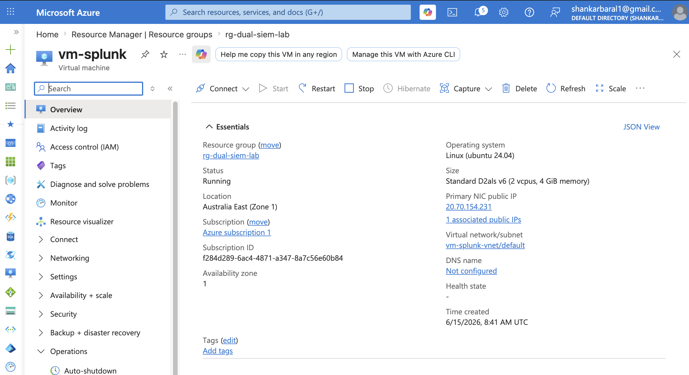

---

### Step 6 — Splunk Enterprise Web UI

Splunk Enterprise 9.4.1 running and accessible via browser, ready to receive forwarded Windows Security Events into the `windows_honeypot` index.

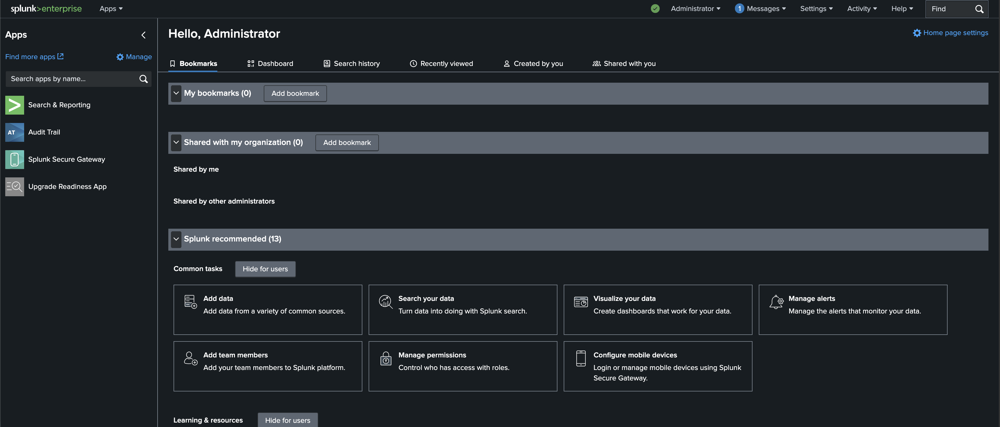

---

### Step 7 — NSG Rules for Splunk

Azure NSG `vm-splunk-nsg` configured with inbound rules: SSH (22), Splunk Web (8000), Splunk Forwarder (9997).

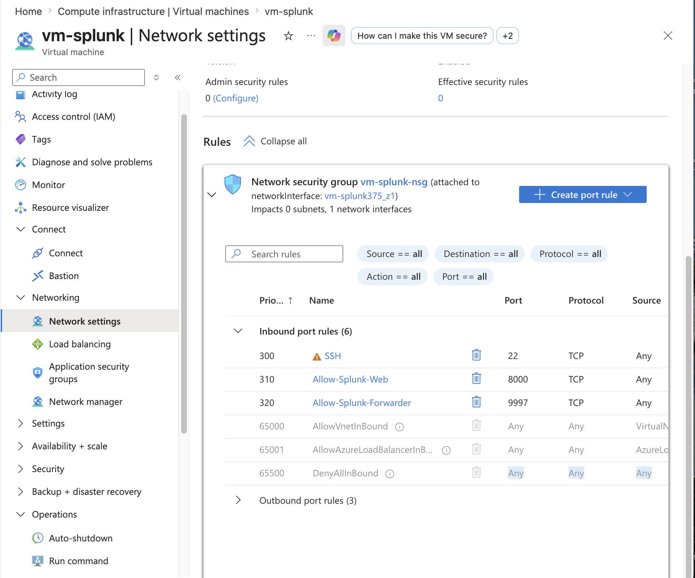

---

### Step 8 — Splunk Universal Forwarder Installed

Splunk Universal Forwarder 10.4.0 installed on the honeypot VM, configured to ship `WinEventLog:Security` events to the Splunk indexer on port 9997.

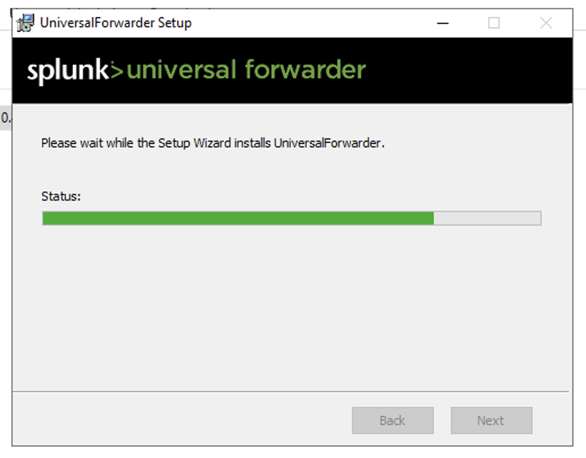

---

### Step 9 — RDP into Honeypot

RDP session confirmed to `vm-honeypot` — Windows Server 2022 running Server Manager. This is the live machine real attackers are hitting from the internet.

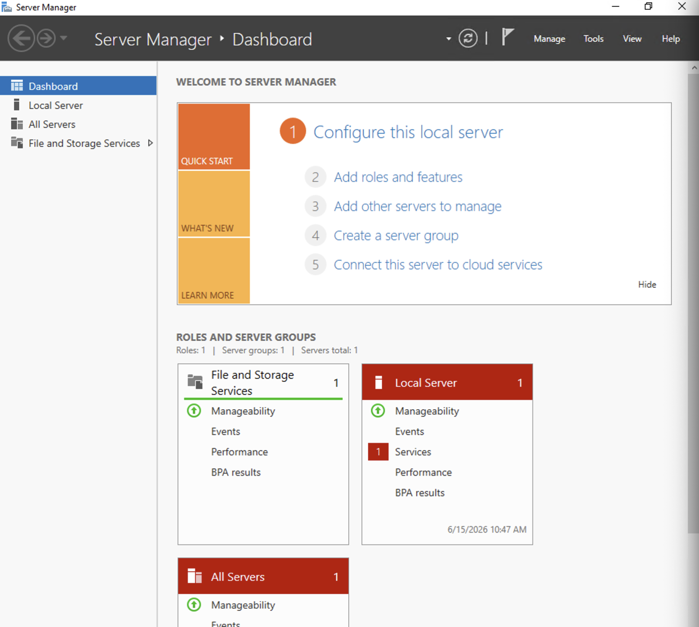

---

### Step 10 — inputs.conf Configured

`inputs.conf` configured on the Universal Forwarder to monitor `WinEventLog://Security` with `index = windows_honeypot` and `disabled = false`. Forwarder restarted and confirmed running (pid 3216).

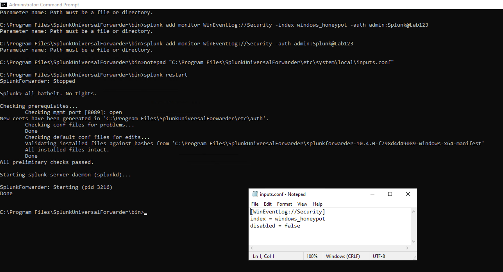

---

## 📡 Data Pipeline

### Splunk — Windows Security Events Flowing ✅

`index=windows_honeypot | head 10` confirms live ingestion — `LogName=Security`, `EventCode=4688`, `ComputerName=vm-honeypot`, `source=WinEventLog:Security`.

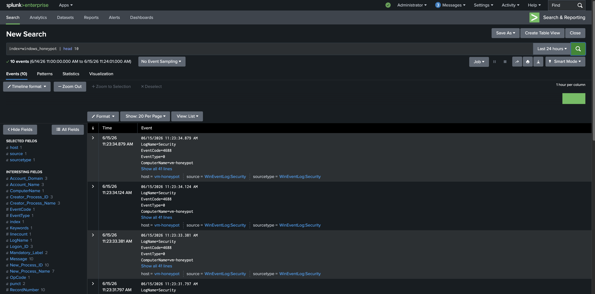

---

### Sentinel — Content Hub Connector Installed ✅

**Windows Security Events** solution (v3.0.12, Microsoft) installed from Sentinel Content Hub — includes 2 data connectors, 20 analytic rules, 2 workbooks, and 50 hunting queries.

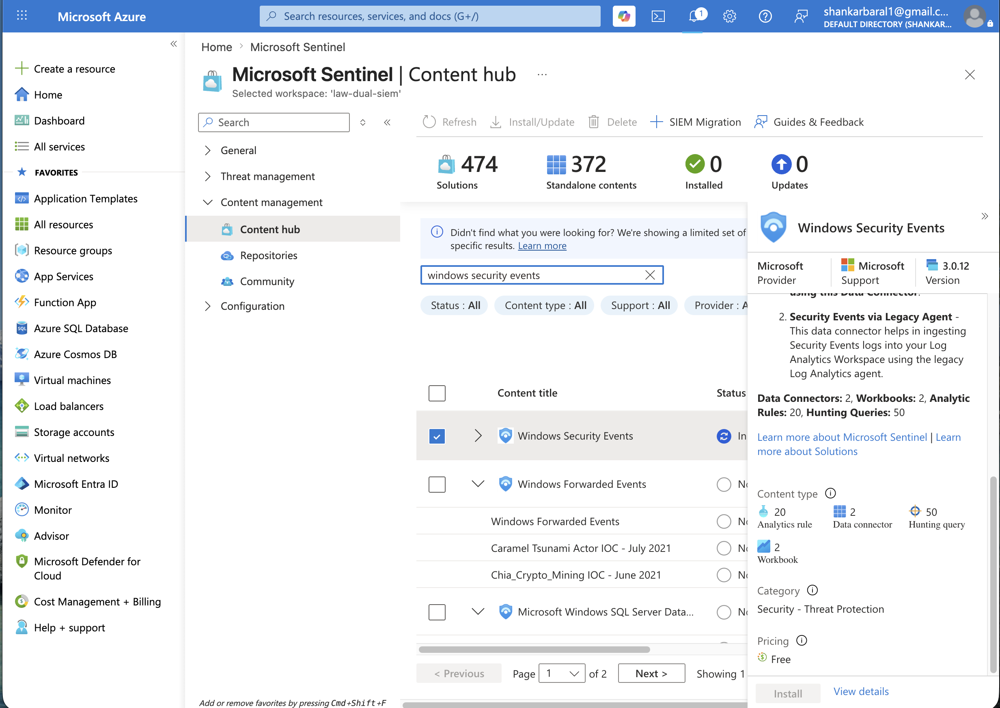

---

### Sentinel — Data Collection Rule Created ✅

DCR `dcr-honeypot-security-events` successfully created via **Windows Security Events via AMA** connector — filter: `AllEvents`, created by Sentinel, targeting the honeypot VM.

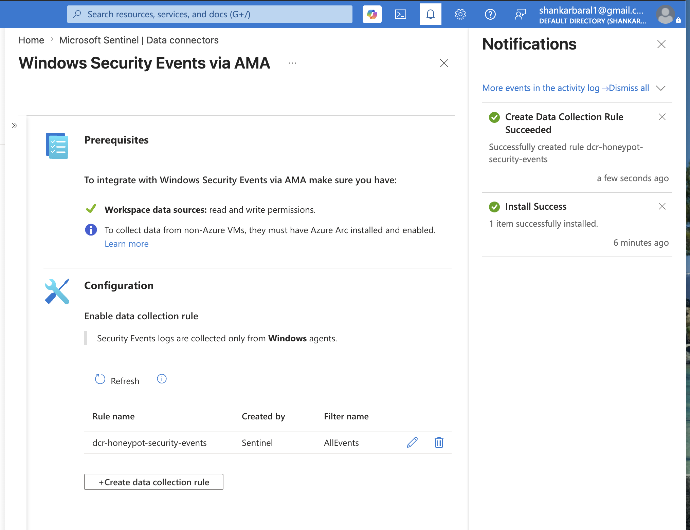

---

### Sentinel — Pre-Agent Baseline (No Data) ✅

Before AMA deployment, a deliberate baseline check: `SecurityEvent | where EventID == 4624` returns **0 results** — confirming no passive data collection was occurring beforehand.

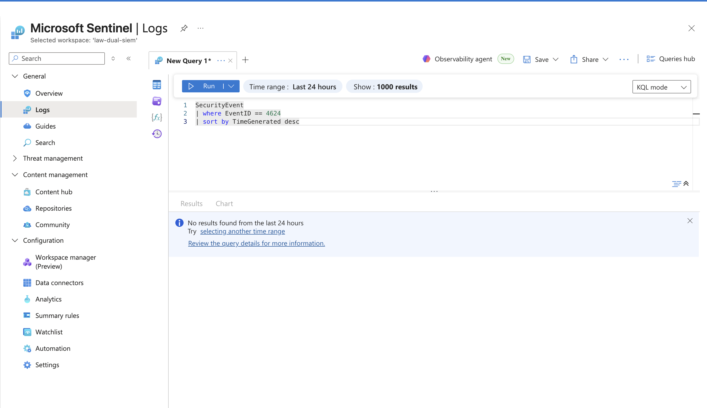

---

### Sentinel — Events Verified Live ✅

Post-deployment: `SecurityEvent | take 10` returns real events from `vm-honeypot` — `NT SERVICE\SplunkForwarder` and `NT AUTHORITY\SYSTEM` accounts visible, confirming both SIEMs are simultaneously ingesting from the same source.

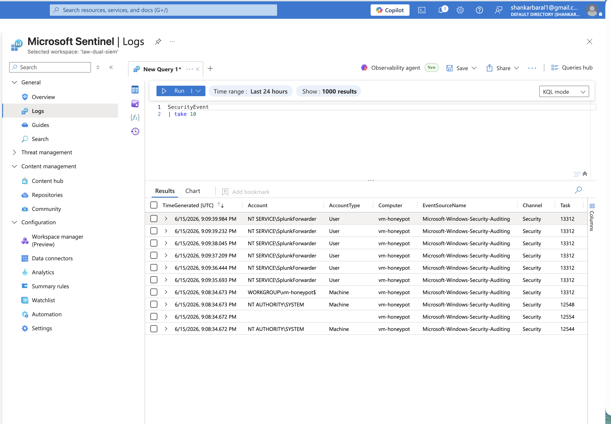

---

## 🔍 Detection Rules

All 5 detections implemented in **both KQL (Sentinel) and SPL (Splunk)** with verified results from real attacker activity.

---

### Detection 1 — Brute Force by Source IP &nbsp; `MITRE:T1110.001`

Identifies external IPs generating more than 10 failed login attempts (EventID 4625) within any 5-minute window — the clearest signal of an automated password spray or brute-force tool.

**KQL — Microsoft Sentinel**

```kusto
SecurityEvent
| where EventID == 4625
| summarize FailedAttempts = count()
    by IpAddress, bin(TimeGenerated, 5m)
| where FailedAttempts > 10
| project TimeGenerated, IpAddress, FailedAttempts
| order by FailedAttempts desc
```

**Result — Sentinel:** 4 attacker IPs detected. Top offender `163.47.70.77` — 14 failed attempts in a single 5-minute window.

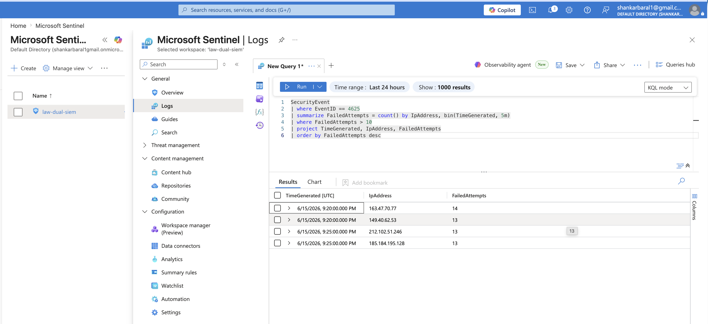

---

**SPL — Splunk Enterprise**

```splunk
index=windows_honeypot EventCode=4625
| bin span=5m _time
| stats count as FailedAttempts by _time, Source_Network_Address
| where FailedAttempts > 10
| sort - FailedAttempts
```

**Result — Splunk:** 6 attacker IPs detected across 104 raw events. `45.142.193.166` and `163.47.70.77` both at 14 attempts — cross-platform results consistent.

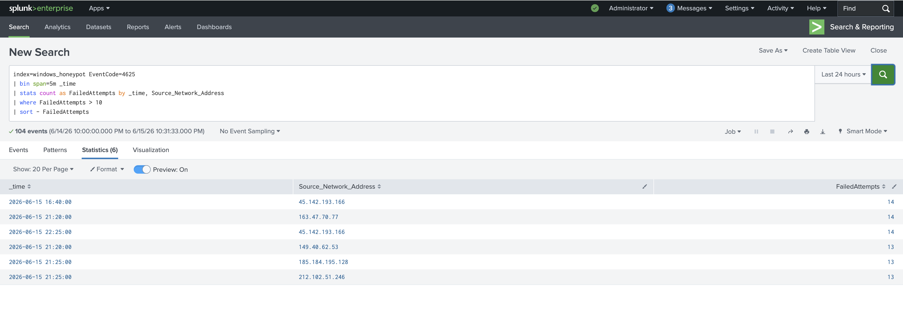

---

### Detection 2 — Account Lockout Correlation &nbsp; `MITRE:T1110`

Correlates failed logins (EventID 4625) with account lockout events (EventID 4740) to confirm accounts actively brute-forced past their lockout threshold — moving from noise to confirmed attack.

**KQL — Microsoft Sentinel (Advanced Hunting)**

```kusto
SecurityEvent
| where EventID in (4625, 4740)
| where TimeGenerated > ago(1h)
| summarize FailedLogins = countif(EventID == 4625), Lockouts = countif(EventID == 4740) by TargetUserName
| where FailedLogins >= 3 and Lockouts > 0
| project TargetUserName, FailedLogins, Lockouts
| order by Lockouts desc
```

**Result — Sentinel:** `labadmin` — 11 failed logins culminating in 1 confirmed lockout. Targeted attack confirmed.

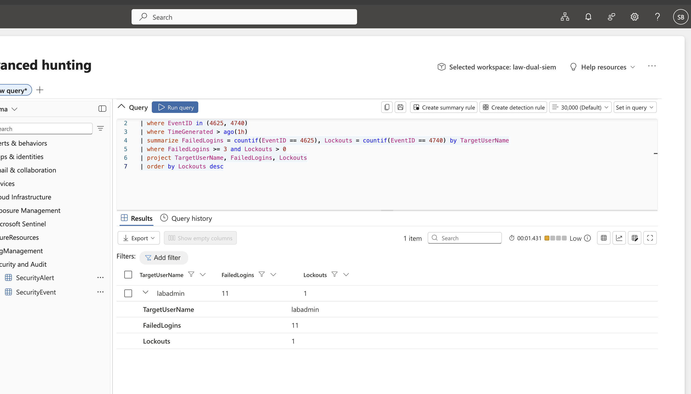

---

**SPL — Splunk Enterprise**

```splunk
index="windows_honeypot" (EventCode=4625 OR EventCode=4740)
| rex field=_raw "Source Network Address:\s*(?<AttackerIP>\d+\.\d+\.\d+\.\d+)"
| rex field=_raw "Account That Was Locked Out:[\s\S]*?Account Name:\s+(?<LockedUser>\S+)"
| sort 0 _time
| streamstats window=1 current=f last(AttackerIP) as LastSeenIP by ComputerName
| where EventCode=4740 AND isnotnull(LockedUser)
| table _time, LockedUser, LastSeenIP, ComputerName
```

**Result — Splunk:** `labadmin` locked out, last seen attacker IP `163.47.70.77` on `vm-honeypot` — same attacker, same account, confirmed across both platforms independently.

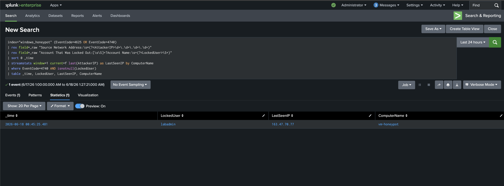

---

### Detection 3 — Geo-Anomaly Lockout &nbsp; `MITRE:T1078`

Enriches lockout correlation with geolocation data to surface attacks originating from unexpected countries or cities — turning a raw IP into actionable threat context.

**KQL — Microsoft Sentinel (Advanced Hunting)**

```kusto
let LockoutEvents = SecurityEvent
| where EventID == 4740
| extend CleanAccount = replace_string(TargetAccount, @"\", "")
| project LockoutTime = TimeGenerated, CleanAccount, Computer;

let FailedLogins = SecurityEvent
| where EventID == 4625
| extend CleanAccount = replace_string(TargetUserName, @"\", "")
| where IpAddress != "-" and isnotnull(IpAddress)
| project FailureTime = TimeGenerated, CleanAccount, IpAddress;

LockoutEvents
| join kind=inner (FailedLogins) on CleanAccount
| where FailureTime between ((LockoutTime - 10m) .. LockoutTime)
| extend geo = geo_info_from_ip_address(IpAddress)
| extend Country = tostring(geo.country), City = tostring(geo.city)
| project LockoutTime, Account = CleanAccount, IpAddress, Country, City, Computer, FailureTime
| sort by LockoutTime desc
```

**Result — Sentinel:** 9 correlated lockout events. Attacker IP `163.47.70.77` geolocated to **Australia, Sydney** — actively targeting a honeypot also hosted in Australia East.

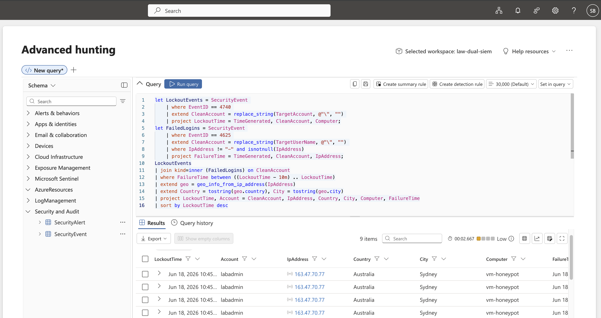

---

**SPL — Splunk Enterprise**

```splunk
index="windows_honeypot" (EventCode=4625 OR EventCode=4740)
| rex field=_raw "Source Network Address:\s*(?<AttackerIP>\d+\.\d+\.\d+\.\d+)"
| rex field=_raw "Account That Was Locked Out:[\s\S]*?Account Name:\s+(?<LockedUser>\S+)"
| sort 0 _time
| streamstats window=1 current=f last(AttackerIP) as LastSeenIP by ComputerName
| where EventCode=4740 AND isnotnull(LockedUser)
| iplocation LastSeenIP
| table _time, LockedUser, LastSeenIP, Country, City, ComputerName
| sort - _time
```

**Result — Splunk:** Same attacker `163.47.70.77` geolocated to **Australia, Adelaide** via Splunk's `iplocation` — minor geo-DB variance between platforms is expected; same country confirmed across both SIEMs.

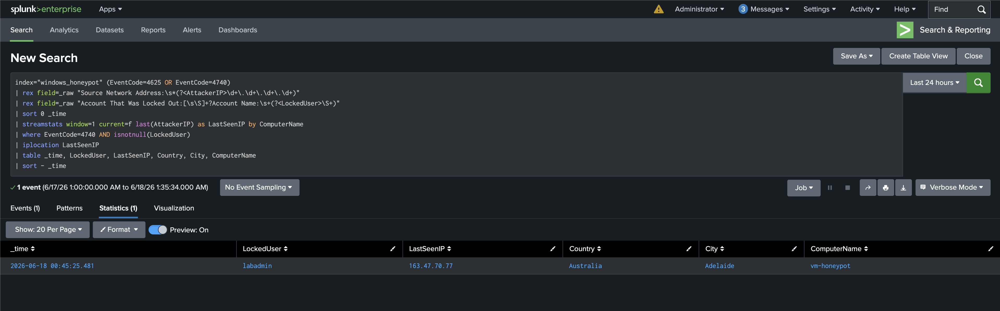

---

### Detection 4 — Privilege Escalation Behavioral Baseline &nbsp; `MITRE:T1078.003`

Baselines special privilege assignment events (EventID 4672) per non-system user account over 24 hours — a tight burst of privilege grants to a non-system account is a strong post-exploitation indicator.

**KQL — Microsoft Sentinel (Advanced Hunting)**

```kusto
SecurityEvent
| where EventID == 4672
| where TimeGenerated > ago(24h)
| where SubjectUserName !in ("DWM-1", "DWM-2", "NETWORK SERVICE", "SYSTEM", "LOCAL SERVICE")
| summarize PrivilegeCount = count(),
            FirstSeen = min(TimeGenerated),
            LastSeen = max(TimeGenerated) by SubjectUserName
| project SubjectUserName, PrivilegeCount, FirstSeen, LastSeen
| order by PrivilegeCount desc
```

**Result — Sentinel:** `labadmin` granted special privileges 2 times between 10:43:47–10:43:48 AM — a 1-second burst consistent with post-exploitation tooling or scripted lateral movement.

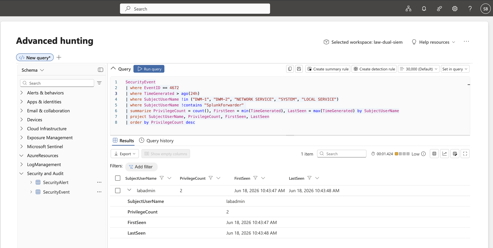

---

**SPL — Splunk Enterprise**

```splunk
index=windows_honeypot EventCode=4672
| stats count as PrivilegeCount,
        min(_time) as FirstSeen,
        max(_time) as LastSeen by Account
| eval FirstSeen=strftime(FirstSeen,"%Y-%m-%d %H:%M:%S"),
       LastSeen=strftime(LastSeen,"%Y-%m-%d %H:%M:%S")
| sort - PrivilegeCount
```

**Result — Splunk:** Confirmed identical 1-second burst of privilege escalation for the `labadmin` account — `PrivilegeCount`, `FirstSeen`, and `LastSeen` map precisely to the KQL findings across both platforms.

---

### Detection 5 — New User Account + Persistence &nbsp; `MITRE:T1136.001`

Detects the classic attacker persistence chain: create a backdoor local account (EventID 4720) then add it to Administrators (EventID 4732) — full kill chain captured end-to-end.

**KQL — Microsoft Sentinel (Advanced Hunting)**

```kusto
SecurityEvent
| where EventID in (4720, 4732)
| extend FinalGroupName = column_ifexists("GroupName", ""),
         FinalTarget = column_ifexists("TargetUserName", column_ifexists("TargetAccount", ""))
| project TimeGenerated, EventID, Account, FinalTarget, FinalGroupName, Activity
| sort by TimeGenerated desc
```

**Result — Sentinel:** 3 events. `vm-honeypot\labadmin` created account named `attacker` (EventID 4720) and immediately added it to `Administrators` and `Users` groups (EventID 4732) at 12:29 PM — full persistence chain captured.

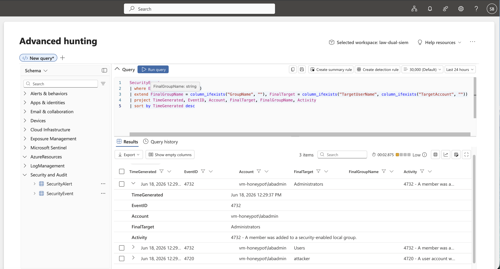

---

**SPL — Splunk Enterprise**

```splunk
index=windows_honeypot (EventCode=4720 OR EventCode=4732)
| eval FinalGroupName=coalesce(GroupName, Group_Name)
| eval FinalTarget=coalesce(TargetUserName, TargetAccount, Target_Account, MemberName)
| rename _time as TimeGenerated, EventCode as EventID,
         Account_Name as Account, Message as Activity
| table TimeGenerated EventID Account FinalTarget FinalGroupName Activity
| sort - TimeGenerated
```

**Result — Splunk:** `labadmin` → `Administrators` (S-1-5-32-544, Group Domain: Builtin) confirmed. Full raw event detail captured including Security IDs, Account Domain `vm-honeypot`, and group SID.

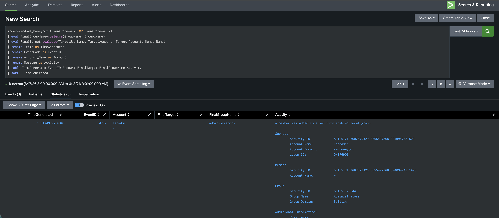

---

## 🚨 Automated Alerting in Sentinel

### Analytic Rule Created

A scheduled analytic rule deployed in Sentinel for Detection 1 — runs every **5 minutes** against the last 5 minutes of data, triggers on any result (threshold > 0). Severity: **Medium**. Category: **Credential Access** (MITRE T1110.001). Validation passed ✅

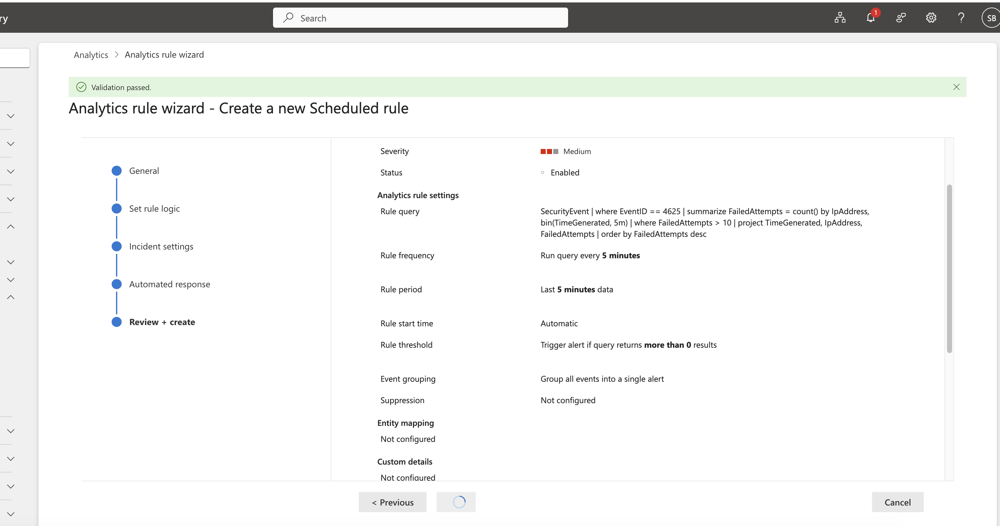

---

### 4 Incidents Auto-Generated ✅

The rule fired without any manual intervention — generating **4 incidents** (IDs 31–34) within the first week. All classified as `Brute Force by Source IP`, Medium severity, Credential access. Zero false negatives, zero manual triggers.

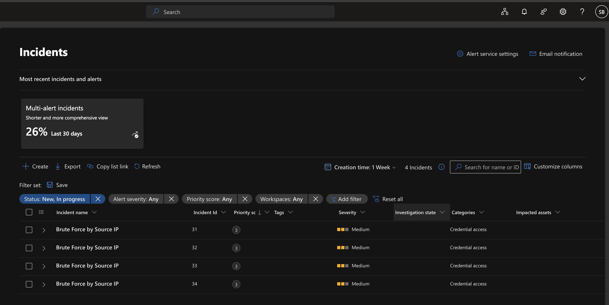

---

## 📁 Repository Structure

```
DUAL-SIEM-DETECTION-LAB/
│
├── architecture/
│   └── .gitkeep
│
├── queries/
│   ├── kql/
│   │   ├── 01-brute-force-by-source-ip.kql
│   │   ├── 02-account-lockout-correlation.kql
│   │   ├── 03-geo-anomaly-lockout.kql
│   │   ├── 04-privilege-escalation-baseline.kql
│   │   └── 05-new-user-persistence.kql
│   │
│   └── spl/
│       ├── 01-brute-force-by-source-ip.spl
│       ├── 02-account-lockout-correlation.spl
│       ├── 03-geo-anomaly-lockout.spl
│       ├── 04-privilege-escalation-baseline.spl
│       └── 05-new-user-persistence.spl
│
├── screenshots/
│   ├── setup/
│   │   ├── 01-azure-resource-group-rg-dual-siem-lab.png
│   │   ├── 02-vm-honeypot-windows-server-2022-overview.png
│   │   ├── 03-log-analytics-workspace-law-dual-siem.png
│   │   ├── 04-microsoft-sentinel-deployed-law-dual-siem.png
│   │   ├── 05-vm-splunk-ubuntu-2404-azure-overview.png
│   │   ├── 06-splunk-enterprise-941-web-ui-home.png
│   │   ├── 07-azure-nsg-ports-8000-9997-splunk.png
│   │   ├── 08-splunk-universal-forwarder-1040-install.png
│   │   ├── 09-rdp-session-vm-honeypot-server-manager.png
│   │   ├── 10-inputs-conf-wineventlog-security-forwarder.png
│   │   ├── 11-windows-security-events-flowing-splunk-index.png
│   │   ├── 12-sentinel-content-hub-windows-security-events-connector.png
│   │   ├── 13-dcr-honeypot-security-events-ama-created.png
│   │   ├── 14-sentinel-logs-no-results-pre-agent-deploy.png
│   │   └── 15-sentinel-security-events-verified-flowing.png
│   │
│   └── detections/
│       ├── 16-kql-detection1-brute-force-by-source-ip-results.png
│       ├── 17-sentinel-analytic-rule-brute-force-t1110001-created.png
│       ├── 18-sentinel-incidents-brute-force-triggered-4-alerts.png
│       ├── 19-spl-detection1-brute-force-6-attacker-ips-results.png
│       ├── 20-kql-detection2-account-lockout-labadmin-11-failed.png
│       ├── 21-spl-detection2-account-lockout-streamstats-ip-correlation.png
│       ├── 22-kql-detection3-geo-anomaly-lockout-australia-sydney.png
│       ├── 23-spl-detection3-geo-anomaly-iplocation-adelaide-australia.png
│       ├── 24-kql-detection4-priv-escalation-labadmin-behavioral-baseline.png
│       ├── 25-kql-detection5-new-user-4720-4732-attacker-account.png
│       └── 26-spl-detection5-new-user-4732-administrators-group.png
│
└── .gitignore
```

---

## 🎯 Key Findings

| # | Finding | Attacker IP | MITRE | Detected In |
|---|---------|-------------|-------|-------------|
| 1 | Brute force — 14 attempts in 5 min | `163.47.70.77` | T1110.001 | Sentinel + Splunk |
| 2 | Brute force — 14 attempts (2nd actor) | `45.142.193.166` | T1110.001 | Splunk |
| 3 | Account lockout — `labadmin` (11 fails → locked) | `163.47.70.77` | T1110 | Sentinel + Splunk |
| 4 | Geo-anomaly — Australia origin confirmed | `163.47.70.77` | T1078 | Sentinel + Splunk |
| 5 | Privilege escalation burst — `labadmin` 4672 x2 | Internal | T1078.003 | Sentinel + Splunk |
| 6 | New backdoor user `attacker` created | Internal | T1136.001 | Sentinel + Splunk |
| 7 | Backdoor user added to `Administrators` group | Internal | T1136.001 | Sentinel + Splunk |

---

## 🧠 Lessons Learned & Challenges

**1. inputs.conf field mapping conflict**
The Splunk Universal Forwarder's default Windows add-on uses different field names than expected (`Source_Network_Address` vs `src_ip`). Resolved by inspecting raw events and writing explicit `rex` field extractions directly in the SPL queries rather than relying on field aliases — making the detection logic self-contained and environment-agnostic.

**2. Geo-IP database variance between platforms**
Azure Sentinel's `geo_info_from_ip_address()` and Splunk's `iplocation` command use different underlying geo-IP databases. The same attacker IP `163.47.70.77` resolved to **Sydney** in Sentinel and **Adelaide** in Splunk. This is expected behaviour — both correctly identify Australia as the origin country, which is the actionable intelligence. Documented as a known cross-platform variance rather than a bug.

**3. AMA agent deployment timing**
After creating the DCR, there was a ~10-minute delay before the Azure Monitor Agent became active on the honeypot VM and events began flowing. The pre-agent baseline screenshot (no results) was deliberately taken to document this gap and prove the pipeline wasn't passively collecting data before the agent was deployed.

**4. SplunkForwarder noise in Sentinel**
Initial Sentinel queries returned `NT SERVICE\SplunkForwarder` as a high-frequency account, polluting privilege escalation baseline results. Resolved by adding `SubjectUserName !contains "SplunkForwarder"` as an exclusion filter — a real-world tuning decision any SOC analyst would face.

**5. KQL `column_ifexists` for schema variance**
Windows Security EventID 4720 and 4732 store the target account in different field names depending on the event subtype (`TargetUserName` vs `TargetAccount`). Used `column_ifexists()` as a resilient field accessor to handle schema differences without the query breaking — a production-ready pattern.

---

## 💡 Skills Demonstrated

| Category | Detail |
|----------|--------|
| **Cloud Infrastructure** | Azure VM provisioning, NSG rules, Log Analytics Workspace, resource group design |
| **Dual SIEM Architecture** | Parallel ingestion pipeline — AMA/DCR → Sentinel and Universal Forwarder → Splunk |
| **KQL** | `summarize`, `join`, `bin`, `countif`, `column_ifexists`, `geo_info_from_ip_address`, `replace_string` |
| **SPL** | `rex`, `streamstats`, `iplocation`, `coalesce`, `eval`, `stats`, `rename`, time binning |
| **MITRE ATT&CK** | T1110.001, T1110, T1078, T1078.003, T1136.001 |
| **Detection Engineering** | Threshold alerting, behavioral baselining, geo-enrichment, persistence chain detection |
| **Detection Tuning** | Noise reduction, field extraction, schema-resilient queries, cross-platform parity validation |
| **Incident Response** | Automated Sentinel analytic rules, incident triage, cross-platform correlation |
| **Security Operations** | Live honeypot operation, real attacker traffic analysis, Windows Security Event forensics |

---

## 👨‍💻 About the Author

<p align="center">
  
</p>

<p align="center">
  
  
  
  
</p>

I am an IT Support Specialist and Junior Cyber Security Analyst based in Canberra, ACT. I hold a **Master of Information Technology (Cyber Security)** from Charles Sturt University, graduating with a highly distinguished **4.92 GPA**.

Currently at **Extratech**, I manage high-volume enterprise escalations, administer **Microsoft Intune** and **Entra ID** identity lifecycles, and monitor perimeter defenses — bridging daily IT operations with proactive security, with a focus on **Azure/M365 administration** and **ASD Essential Eight** alignment.

Beyond enterprise operations, I actively design and deploy **cloud-native security pipelines** — including global threat intelligence dashboards, zero-touch **Windows Autopilot** environments, and **Microsoft Sentinel** architectures that intercept and visualize thousands of live brute-force attacks. Currently advancing SOC capabilities toward **Blue Team Level 1 (BTL1)** and **Microsoft SC-200** certifications.

<p align="left">
  <a href="https://www.linkedin.com/in/shankarbaral1">
    
  </a>
  <a href="https://github.com/shank078">
    
  </a>
</p>

---

<p align="center">
  <b>Built with real attacker traffic. No simulated data. Every detection fired against live threats from the internet.</b>
</p>

<p align="center">
  
</p>
